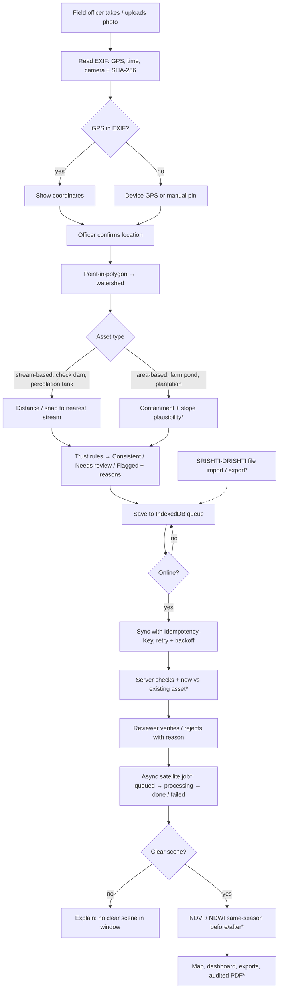

# Architecture — Built vs Planned

Last updated: 3 Oct 2026

## Built (in this repo, runs today)

```
React 19 PWA (Vite, TS)
 ├─ src/pages/        Dashboard, Map analysis, Upload, Workspace sections
 ├─ src/components/   WatershedMap (MapLibre), WatershedPanel, TrustPanel,
 │                    SyncIndicator, DemoBadge
 ├─ src/services/     hydrosnapService (mock | REST), offlineStore (IndexedDB),
 │                    syncService (queue → POST /api/v1/uploads)
 ├─ src/utils/        geo (PIP, bounds, nearest stream), trust rules, exporters
 └─ src/services/mock/mockData.ts  DEMO watersheds, assets, streams, indices
```

| Capability | Where | Notes |
|---|---|---|
| Point-in-watershed at upload | `src/utils/geo.ts` → `findContainingWatershed` | finest level wins; outside → warning + flag |
| Stream snap (stream-based assets) | `src/utils/geo.ts` → `nearestStreamPoint` | snapped point stored separately; original kept |
| Trust status | `src/utils/trust.ts` | rules only, no AI; "Flagged" = human review, never auto-reject |
| Offline sync | `src/services/offlineStore.ts`, `src/services/syncService.ts` | pending/syncing/synced/failed, exp. backoff 5 s → 5 min, Idempotency-Key |
| Real boundaries | `src/components/maps/WatershedMap.tsx` (`pmtiles://`) + `scripts/prepare_watersheds` | off until env var set |

## Planned (not built)

| Phase | Component | Notes |
|---|---|---|
| 2 | FastAPI + PostgreSQL/PostGIS (docker compose), JWT roles, photo storage, audit table | must return the JSON shapes in `src/types/domain.ts` |
| 3 | Server trust checks: SHA-256 index, `ST_Contains`, `ST_ClosestPoint`/KNN snap, asset matching by proximity + type; optional content model (suggestion + confidence only) | mirrors `utils/trust.ts` |
| 4 | Celery + Redis jobs: NDVI/NDWI from Landsat (30 m) / Sentinel-2 via open STAC or GEE; same-season before/after; "no clear scene" state | replaces simulated overlays |
| 5 | DEM (CartoDEM / Copernicus / SRTM — verify licence) → slope, flow accumulation, streams | replaces demo streams |
| 6 | Audited PDF, dashboards, Hindi/Marathi upload flow, SRISHTI-DRISHTI file import/export | |
| 7 | Playwright e2e, load test, deployment guide | |

### API routes the frontend expects (`/api/v1`)

`GET /watersheds`, `GET /layers`, `GET/POST /assets`, `GET/POST /uploads`
(`Idempotency-Key` header), `PATCH /uploads/{id}/verify`, `GET/POST /analytics`,
`GET /analytics/jobs`, `GET /analytics/results`, `GET /interventions`,
`GET/POST /reports`, `GET /users/me`, `GET /users/team`.

## Corrected app flow


`*` = planned.
